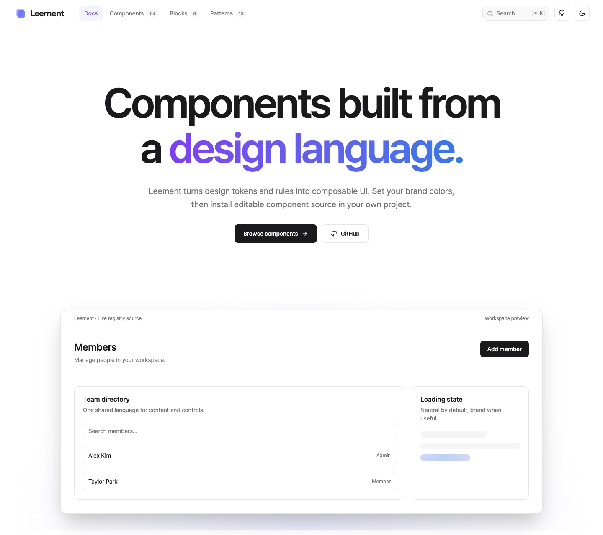
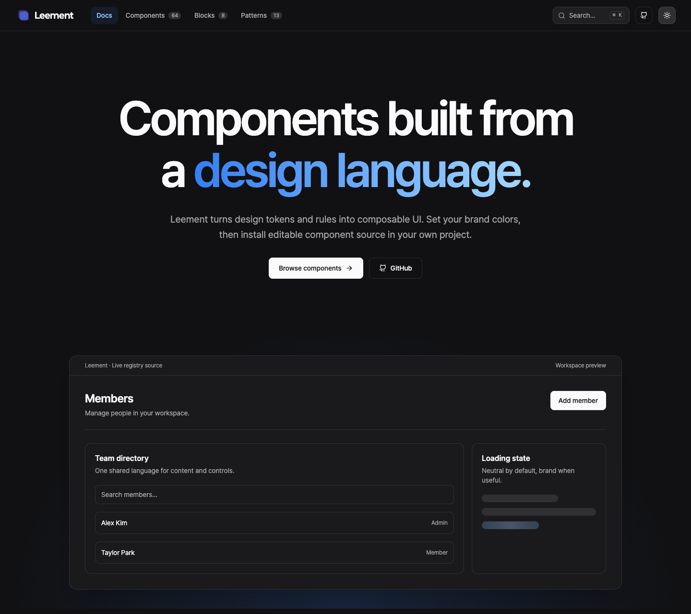
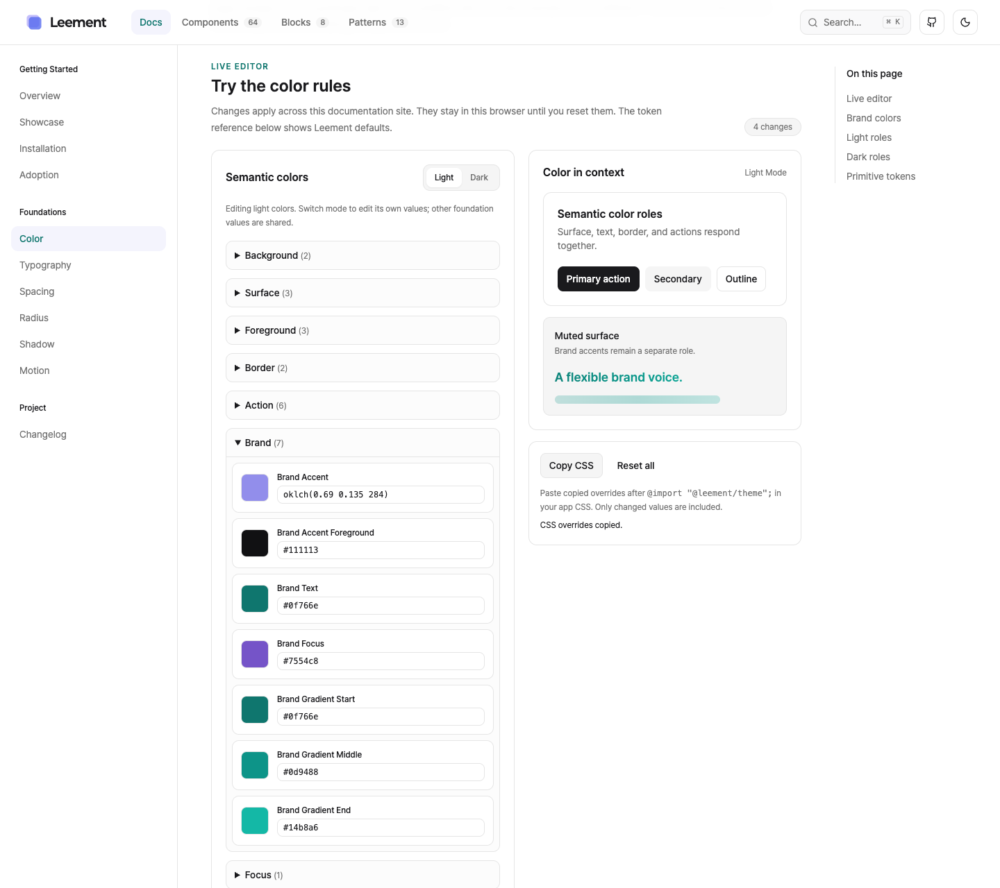

<p align="center">
  
</p>

<h1 align="center"><strong>Leement</strong></h1>

<p align="center">
  <strong>공통 디자인 언어를 토큰과 수정 가능한 컴포넌트 소스로 전달하는 오픈소스 디자인 시스템</strong>
</p>

<p align="center">
  <a href="LICENSE"></a>
  
  
  
  
</p>

<p align="center">
  <a href="#quick-start">Quick Start</a> ·
  <a href="#프로젝트에-설치">프로젝트에 설치</a> ·
  <a href="#주요-기능">주요 기능</a> ·
  <a href="#시스템-구성">시스템 구성</a> ·
  <a href="#검증과-기여">검증과 기여</a> ·
  <a href="#문서와-배포-상태">문서와 배포 상태</a>
</p>

CopySinger의 라이트 UI와 Leesfield의 다크 UI가 공유하는 디자인 의도를 바탕으로 만들었습니다. **Design Tokens + Design Rules가 디자인의 기준**이며, shadcn registry는 React 프로젝트에 필요한 소스를 전달합니다. 설치한 컴포넌트 코드는 사용하는 프로젝트가 소유하고 자유롭게 수정합니다.

<p align="center">
  
</p>
<p align="center">
  
</p>

## 목차

- [Quick Start](#quick-start)
- [프로젝트에 설치](#프로젝트에-설치)
- [주요 기능](#주요-기능)
- [시스템 구성](#시스템-구성)
- [기술 스택](#기술-스택)
- [프로젝트 구조](#프로젝트-구조)
- [검증과 기여](#검증과-기여)
- [문서와 배포 상태](#문서와-배포-상태)
- [라이선스](#라이선스)

## Quick Start

Node.js 22 이상과 pnpm 10.34.5를 사용합니다. 저장소를 내려받은 뒤 루트에서 실행하세요.

```bash
pnpm install --frozen-lockfile
pnpm --filter @leement/docs dev
```

[http://localhost:3000](http://localhost:3000)에서 문서와 실제 컴포넌트를 볼 수 있습니다. docs 실행 명령은 tokens·theme·registry를 먼저 빌드합니다. 별도 데이터베이스나 API 키는 필요하지 않습니다.

| 로컬 페이지 | 내용 |
| --- | --- |
| [홈](http://localhost:3000) | 디자인 언어와 대표 UI |
| [전체 미리보기](http://localhost:3000/showcase) | 검색·분류할 수 있는 UI·패턴·블록 카탈로그 |
| [Foundations](http://localhost:3000/foundations/color) | 토큰 설명, 사이트 전체에 적용되는 실시간 편집, CSS 복사 |
| [Getting Started](http://localhost:3000/getting-started) | theme과 registry 설치 |
| [도입 가이드](http://localhost:3000/adoption) | 기존 프로젝트의 공통 UI 교체 기준과 예제 |

registry JSON은 `http://localhost:3000/r/{name}.json`에서 제공합니다. 3000번 포트를 이미 사용한다면 `pnpm --filter @leement/docs dev --port 3001`로 실행하고 소비자 registry 주소도 같은 포트로 바꾸세요.

## 프로젝트에 설치

### 1. Theme 준비

현재는 공개 npm 패키지를 조회할 수 없어 **로컬 패키지 설치로 시험**합니다. 위의 문서 서버를 실행한 상태에서, 다른 터미널의 Leement 루트에서 theme을 패키징하세요.

```bash
pnpm --filter @leement/theme pack --pack-destination /tmp/leement-pack
```

Tailwind CSS v4와 shadcn 설정이 준비된 React 프로젝트에서 실행합니다. `components.json`이 없다면 먼저 `npx shadcn@latest init`으로 초기화하세요.

```bash
pnpm add /tmp/leement-pack/leement-theme-0.1.0.tgz
```

전역 CSS에서 Tailwind 다음에 theme을 불러옵니다. 별도로 `shadcn/tailwind.css`를 불러오는 프로젝트라면 Leement를 그 파일보다 앞에 두세요.

```css
@import "tailwindcss";
@import "@leement/theme";
```

theme에는 CSS 변수·reset·Tailwind 호환 매핑과 기본 폰트가 포함됩니다. 일반 UI는 Pretendard Variable, 로고 글자는 Paperlogy Bold(700)를 사용합니다.

### 2. Registry 연결

소비자 프로젝트의 기존 `components.json`에 `registries` 설정을 추가합니다. 다른 설정은 유지하세요.

```json
{
  "registries": {
    "@leement": "http://localhost:3000/r/{name}.json"
  }
}
```

기본 `@/components/ui`, `@/components/patterns`, `@/components/blocks`, `@/lib` 소스 경로를 기준으로 제공합니다. 별도 폴더 구조가 필요한 경우 설치한 소스의 경로와 import를 프로젝트에 맞춰 수정하세요.

### 3. 필요한 소스만 설치

```bash
npx shadcn@latest add @leement/button @leement/empty-state @leement/settings-section
```

pattern과 block이 쓰는 Card·FormSection 및 helper는 registry dependency로 함께 설치됩니다. 설치된 소스를 직접 import합니다.

```tsx
import { Button } from "@/components/ui/button";
import { EmptyState } from "@/components/patterns/empty-state";
import { SettingsSection } from "@/components/blocks/settings-section";

export function WorkspaceExample() {
  return (
    <SettingsSection title="Workspace" description="워크스페이스 설정">
      <EmptyState
        title="아직 멤버가 없습니다"
        description="첫 멤버를 초대해 함께 작업하세요."
        action={<Button variant="primary">멤버 초대</Button>}
      />
    </SettingsSection>
  );
}
```

예제의 클릭 동작과 데이터 연결은 앱에서 구현합니다. `@leement/react`에서 가져오는 방식 대신, 설치된 파일의 스타일·구조·동작을 프로젝트에서 수정하세요.

### 공개 배포 후

`@leement/theme`이 npm에 공개되면 tarball 설치 대신 다음 명령을 사용합니다.

```bash
pnpm add @leement/theme
```

문서 사이트를 배포하면 registry의 localhost 주소를 **실제로 배포한 사이트의 `/r/{name}.json` 주소**로 바꿉니다. 공개 패키지와 registry가 모두 준비되어야 로컬 서버 없이 같은 `npx shadcn@latest add @leement/button` 명령을 사용할 수 있습니다.

## 주요 기능

### Foundations와 실시간 테마 편집

- Color·Typography·Spacing·Radius·Shadow·Motion의 기본값과 사용 규칙
- 값을 바꾸면 문서 전체와 실제 registry 예제에 즉시 반영
- 클릭으로 여는 color picker, 모드별 색상 설정과 대비 안내
- 브라우저 내 저장·전체 초기화·기본값과 달라진 CSS만 복사
- 본문·브랜드 폰트를 독립적으로 선택하거나 custom family로 지정

편집은 브라우저 미리보기입니다. 원본 토큰이나 npm 패키지를 바꾸지 않으며, 복사한 CSS는 앱의 theme import 뒤에 적용합니다. 커스텀 폰트 파일은 앱에서 로드합니다.

<p align="center">
  
</p>

### 공통 UI·Patterns·Blocks

현재 공개 카탈로그는 **UI 64개 · Patterns 13개 · Blocks 8개**입니다. registry 총 88개 항목 중 내부 helper 3개는 이 수에 포함하지 않습니다.

| 레이어 | 대표 항목 | 책임 |
| --- | --- | --- |
| UI | Button, Input, Card, Dialog, Tabs, Slider, Table, Editor | 반복되는 조작과 표면 |
| Patterns | PageHeader, EmptyState, FormSection, SearchField, StatCard, BrandLogo | 페이지·검색·폼·브랜드의 반복 구조 |
| Blocks | SettingsSection, BentoGrid, Gantt, Kanban, Sandbox, Reel, Deck, DialogStack | 화면에서 바로 조합할 수 있는 큰 UI |

문서의 Preview·Code·Source는 배포하는 registry source를 사용합니다. 각 항목에서 설치 방법, 사용 의도, 접근성, API와 maturity를 확인할 수 있습니다.

### 브랜드·미디어·공통 모션

- light/dark semantic color와 소비자가 재정의하는 브랜드 색상·gradient·focus 역할
- 아이콘과 로고 글자를 조합하는 BrandLogo, 선택적인 브랜드 Skeleton과 강조 효과
- 파형·배속·음량을 제공하는 AudioPlayer와 재생·탐색·자막을 제공하는 VideoPlayer
- RevealContent, TextReveal, Collapsible, MediaReveal, BrandAction, RotatingContent
- reduced motion 대응과 미디어 enhancement 실패 시 native controls

앱의 녹음·분석·API·데이터 저장은 소비자가 구현합니다. 공용 소스는 반복되는 UI와 상호작용을 제공합니다.

## 시스템 구성

```text
Design Language + Design Rules
              ↓
Design Tokens     @leement/tokens · framework independent
              ↓
Web Theme         @leement/theme · CSS variables / fonts / reset
              ↓
UI Components     registry/ui
              ↓
Patterns          registry/patterns
              ↓
Blocks            registry/blocks
              ↓
Application       설치한 소스와 제품 로직을 소유
```

- **Tokens**: primitive → semantic을 기본으로 하고 component token은 필요한 경우에만 추가합니다. React·Tailwind·shadcn에 의존하지 않습니다.
- **Theme**: Leement의 `--lm-*` 변수를 웹에 제공합니다. shadcn의 `--background`, `--primary` 등은 Leement 변수에서 파생하는 compatibility layer입니다.
- **Registry**: UI·pattern·block 소스와 설치 dependency를 전달합니다. 소비자 앱은 공유 theme을 사용하면서 설치한 코드를 직접 관리합니다.
- **Docs**: 규칙과 실제 예제를 설명하고 registry JSON을 제공합니다.

사용 규칙은 [Design System](docs/designs/design-system.md)에 정리되어 있습니다.

## 기술 스택

| 영역 | 기술 |
| --- | --- |
| Workspace | pnpm 10.34.5 · Turborepo |
| Docs | Next.js 16 · React 19 |
| 스타일 | Tailwind CSS v4 · CSS custom properties |
| UI 동작 | Base UI · Radix primitives · native HTML |
| 언어·품질 | TypeScript strict · ESLint · Vitest · Testing Library |
| 소스 배포 | shadcn registry |
| 선택적인 확장 | Motion · WaveSurfer.js · Recharts · TipTap · Sandpack |

확장 dependency는 사용하는 registry 항목에 따라 설치됩니다. 실제 버전은 [package.json](package.json)과 [pnpm-lock.yaml](pnpm-lock.yaml)을 기준으로 합니다.

## 프로젝트 구조

```text
leement/
├─ apps/docs/             # 문서·실제 미리보기·registry host
├─ packages/
│  ├─ tokens/             # framework-agnostic token 정본
│  └─ theme/              # CSS 변수·호환 계층·reset·폰트
├─ registry/
│  ├─ ui/                 # 재사용 컴포넌트 source
│  ├─ patterns/           # 반복되는 제품 UI 구조
│  ├─ blocks/             # 큰 화면 조합
│  └─ lib/                # 설치되는 내부 helper
├─ tooling/               # 공통 ESLint·TypeScript 설정
├─ docs/                  # PRD·디자인 규칙·Feature 문서
├─ registry.json          # 항목과 dependency metadata
├─ components.json        # docs의 shadcn 설정
├─ pnpm-workspace.yaml
└─ turbo.json
```

## 검증과 기여

```bash
pnpm check
```

이 명령은 tokens·theme·registry·docs build와 typecheck·lint·test를 실행합니다. 개별 확인에는 `pnpm build`, `pnpm typecheck`, `pnpm lint`, `pnpm test`를 사용할 수 있습니다.

컴포넌트를 제안할 때는 [디자인 규칙](docs/designs/design-system.md)을 먼저 확인하세요.

- 한 번 사용한 UI는 앱에 두고, 두 번째 반복에서 candidate를 검토합니다. 세 번째 이상 반복되면 디자인 시스템 승격을 검토합니다.
- maturity는 `experimental` → `candidate` → `stable`로 관리합니다. 항목 수가 많다는 이유로 안정성이 검증된 것은 아닙니다.
- 의미 기반 token을 사용하고 HTML semantics와 Base UI/Radix의 키보드·focus·ARIA 동작을 유지합니다.
- 문서는 배포하는 source를 직접 사용합니다. 새로운 UI에는 사용 의도와 실제 접근성·설치 검증을 함께 제공합니다.

Feature는 [lee-spec-kit 문서 워크플로](docs/README.md)로 관리합니다. 기존 두 앱의 대표 사용처는 격리 환경에서 교체 검증했으며, 원본 앱 전체 적용이 완료된 상태를 뜻하지 않습니다.

## 문서와 배포 상태

2026-10-02 확인 기준 `@leement/theme`과 `@leement/tokens`의 공개 npm 조회는 404였습니다. 공개 registry·demo 주소는 확정되지 않았습니다. 현재 README는 로컬 docs와 패키징한 theme으로 사용하는 경로를 안내합니다.

| 문서 | 내용 |
| --- | --- |
| [제품 요구사항](docs/prd/leement-prd.md) | 디자인 시스템의 범위와 도입 기준 |
| [디자인 규칙](docs/designs/design-system.md) | 의미색·폰트·컴포넌트·접근성·승격 규칙 |
| [문서 안내](docs/README.md) | 문서 구조와 Feature 워크플로 |
| [Changelog](http://localhost:3000/changelog) | 로컬 문서 사이트의 변경 기록 |
| [THIRD_PARTY_NOTICES](THIRD_PARTY_NOTICES.md) | Kibo UI·WaveSurfer.js 등 외부 코드 고지 |

## 라이선스

Leement는 [MIT](LICENSE) 라이선스로 제공합니다. 외부 코드의 조건은 [THIRD_PARTY_NOTICES](THIRD_PARTY_NOTICES.md), 기본 폰트의 조건은 [Pretendard OFL](packages/theme/fonts/Pretendard-OFL.txt)과 [Paperlogy OFL](packages/theme/fonts/Paperlogy-OFL.txt)을 확인하세요.
